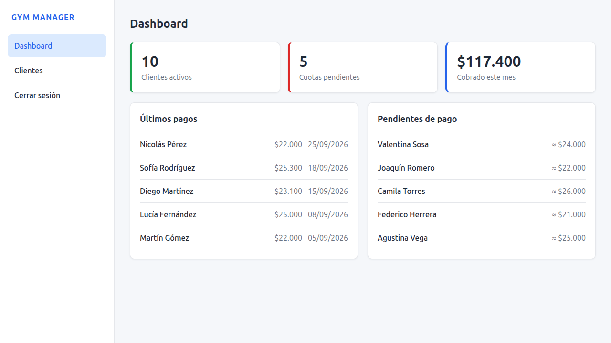
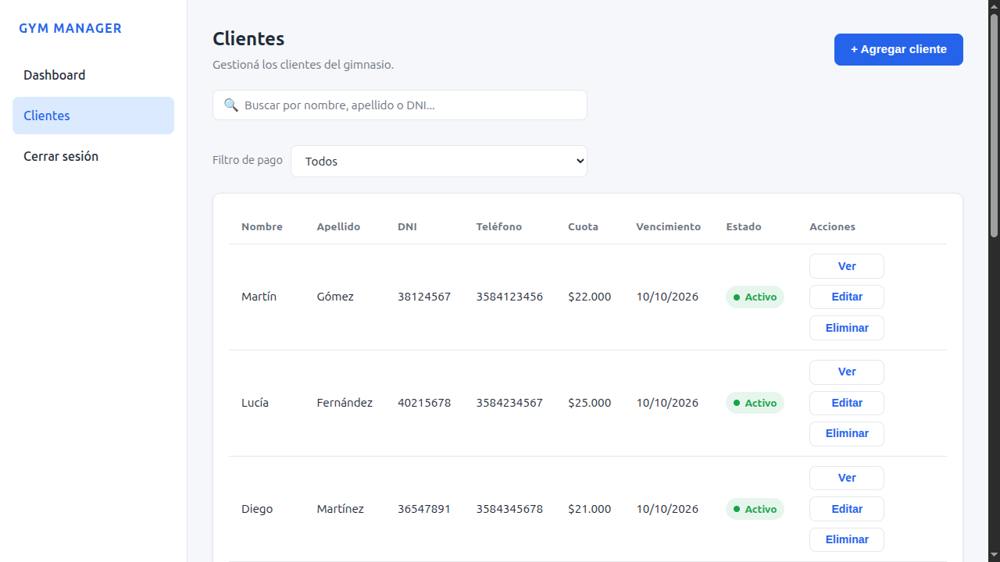
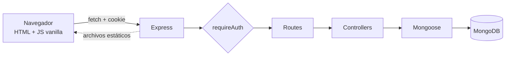

<div align="center">

# 🏋️ Gym Manager

**Gestión de socios y cobro de cuotas para gimnasios.**

Reemplaza el cuaderno del gimnasio por una app web: registra clientes, cobra la cuota mensual con recargo automático por mora y consulta el historial de pagos de cada socio.

### 👉 [Deploy](https://appgym-wgk1.onrender.com/)


</div>

---

## 💡 Por qué existe

Este proyecto nació para el dueño de un gimnasio que anotaba todo en un cuaderno: socios, cuotas y pagos. Eso hacía difícil saber quién había pagado, cuánto cobrar con recargo y qué clientes estaban pendientes. **Gym Manager** centraliza todo en una sola app, pensada para un único administrador y para usarse tanto desde la PC como desde el celular.

> El repositorio se llama **AppGym**; la aplicación se llama **Gym Manager**.

---

## 📸 Capturas

> _Guarda las imágenes en `docs/`._

**Escritorio**

| Dashboard | Clientes |
|---|---|
|  |  |

**Móvil**

| Login | Clientes | Ficha |
|---|---|---|
|  |  |  |

---

## ✨ Características

**👥 Clientes**
- Alta, edición y eliminación con formularios en modal.
- Búsqueda en vivo por nombre, apellido o DNI (sin distinguir mayúsculas ni tildes).
- Filtro de **pendientes de pago** del mes actual.
- Ficha individual con todos sus datos.
- No permite borrar un cliente que tenga pagos registrados.

**💵 Pagos**
- Registro de pago mensual con cálculo automático de recargo y total.
- Historial por cliente, del más reciente al más antiguo, con edición y borrado.
- Un solo pago por cliente, mes y año (garantizado también por índice único en la base).

**📊 Dashboard**
- Clientes activos, cuotas pendientes y total cobrado en el mes.
- Últimos pagos y próximos pendientes de un vistazo.

**🔐 Autenticación**
- Login de administrador con sesión en cookie `HttpOnly`.
- Todas las rutas de datos protegidas en el backend.
- Límite de intentos de login.

**📱 Responsive**
- Diseño mobile-first: tabla en escritorio, tarjetas en el celular.

---

## 🧾 Reglas de negocio de los pagos

| Regla | Detalle |
|---|---|
| Recargo por mora | **0 %** hasta el día 10 del mes (inclusive), **10 %** desde el día 11. Se puede ajustar al registrar el pago |
| Cálculo | `recargo = cuota × % / 100` · `total = cuota + recargo` (2 decimales) |
| Pagos parciales | No existen: el importe pagado debe coincidir con el total |
| Fechas | No se aceptan meses futuros ni fechas de pago futuras |
| Duplicados | Un cliente no puede tener dos pagos del mismo mes/año |
| Cuota del cliente | Si el pago es del mes actual, `cuotaActual` del cliente se actualiza con la cuota base (sin recargo) |
| Nueva cuota del mes siguiente | Dato **informativo** y opcional; no modifica la cuota del cliente |
| Pendiente | Cliente activo sin pago en el mes y año actuales (no hay deuda acumulada) |

---

## 🧱 Tecnologías

| Capa | Stack |
|---|---|
| Frontend | HTML5, CSS3 (variables, mobile-first, BEM) y JavaScript vanilla, sin frameworks ni build |
| Backend | Node.js 22, Express 5 |
| Base de datos | MongoDB (Atlas) con Mongoose 9 |
| Autenticación | JWT (`jsonwebtoken`) en cookie HttpOnly, `bcryptjs` |
| Otros | `cors`, `cookie-parser`, `dotenv` |

---

## 🏗️ Arquitectura

En producción Express sirve el frontend y la API desde el **mismo origen**, por eso no hay problemas de CORS y la cookie puede usar `SameSite=Strict`.



### Estructura del proyecto

```
AppGym/
├── backend/
│   └── src/
│       ├── app.js            # Configuración de Express, CORS, rutas y estáticos
│       ├── server.js         # Conexión a Mongo y arranque
│       ├── config/           # Conexión a la base de datos
│       ├── middleware/       # requireAuth (JWT en cookie)
│       ├── models/           # Cliente y Pago
│       ├── controllers/      # Lógica de auth, clientes y pagos
│       └── routes/           # Endpoints
└── frontend/
    ├── index.html            # Dashboard
    ├── clientes.html         # Listado y alta/edición
    ├── cliente.html          # Ficha, pagos e historial
    ├── login.html
    ├── css/styles.css
    └── js/                   # api.js, auth.js, main.js, clientes.js, pagos.js, historial.js
```

---

## 🚀 Instalación y ejecución

**Requisitos:** Node.js 22.x y una base MongoDB (local o Atlas).

```bash
# 1. Clonar
git clone https://github.com/Ticran/AppGym.git
cd AppGym/backend

# 2. Instalar dependencias
npm install

# 3. Crear el archivo .env (ver tabla de abajo)

# 4. Iniciar
npm start
```

Abre **http://localhost:3000/login.html**. El backend ya sirve el frontend, no hace falta levantar nada más.

### Variables de entorno

Crea `backend/.env`:

```env
PORT=3000
MONGODB_URI=...
ADMIN_USERNAME=...
ADMIN_PASSWORD_HASH=...
JWT_SECRET=...
AUTH_EXPIRA_HORAS=12
```

| Variable | Obligatoria | Descripción |
|---|:---:|---|
| `MONGODB_URI` | ✅ | Connection string de MongoDB |
| `ADMIN_USERNAME` | ✅ | Usuario del administrador |
| `ADMIN_PASSWORD_HASH` | ✅ | Hash **bcrypt** de la contraseña |
| `JWT_SECRET` | ✅ | Secreto para firmar la sesión (mínimo 32 caracteres recomendado) |
| `PORT` | | Puerto del servidor (default `3000`) |
| `AUTH_EXPIRA_HORAS` | | Duración de la sesión (default `12`) |
| `NODE_ENV` | | `production` activa cookie `Secure` y `trust proxy` |
| `CORS_ORIGEN` | | Orígenes permitidos, separados por coma |
| `COOKIE_SECURE` | | Fuerza el flag `Secure` de la cookie (`true`/`false`) |
| `TZ_APP` | | Zona horaria del backend (default `America/Argentina/Buenos_Aires`) |

### Generar el hash de la contraseña

La app es **monousuario**: no tiene registro. El administrador se define por variables de entorno, así que el hash se genera una sola vez antes de configurar el `.env`. Desde la carpeta `backend/`:

```bash
node -e "console.log(require('bcryptjs').hashSync('TU_CONTRASEÑA', 10))"
```

Copia el resultado en `ADMIN_PASSWORD_HASH`.

---

## 🔌 API REST

Base: `/api`. Todas las rutas requieren sesión, salvo las indicadas como públicas.

### Autenticación

| Método | Ruta | Descripción |
|---|---|---|
| GET | `/api` | Health check (público) |
| POST | `/api/auth/login` | Inicia sesión (público) |
| POST | `/api/auth/logout` | Cierra sesión (público) |
| GET | `/api/auth/me` | Devuelve el usuario de la sesión |

### Clientes

| Método | Ruta | Descripción |
|---|---|---|
| GET | `/api/clientes` | Lista de clientes |
| POST | `/api/clientes` | Crea un cliente |
| GET | `/api/clientes/:id` | Obtiene un cliente |
| PUT | `/api/clientes/:id` | Actualiza un cliente |
| DELETE | `/api/clientes/:id` | Elimina un cliente (409 si tiene pagos) |
| GET | `/api/clientes/:id/pagos` | Historial de pagos del cliente |

### Pagos

| Método | Ruta | Descripción |
|---|---|---|
| GET | `/api/pagos` | Lista de pagos. Filtros: `?cliente=`, `?anio=`, `?mes=`, `?limite=` (1–500) |
| POST | `/api/pagos` | Registra un pago |
| GET | `/api/pagos/:id` | Obtiene un pago |
| PUT | `/api/pagos/:id` | Actualiza un pago (recalcula recargo y total) |
| DELETE | `/api/pagos/:id` | Elimina un pago |

---

## 🗄️ Modelo de datos

**`clientes`**: `nombre`, `apellido`, `dni` (único), `telefono`, `fechaIngreso`, `cuotaActual`, `fechaVencimiento`, `estado` (`Activo` | `Inactivo`).

**`pagos`**: `cliente` (ref), `anio`, `mes`, `importeCuota`, `porcentajeRecargo`, `importeRecargo`, `importeTotal`, `importePagado`, `fechaPago`, `estado`, `nuevaCuotaMesSiguiente` (opcional) y `createdAt`/`updatedAt`.

- Relación 1:N: un cliente, muchos pagos.
- Índice único `{ cliente, anio, mes }`: un pago por cliente y mes.
- Las fechas se guardan como texto `AAAA-MM-DD`.
- No hay colección de usuarios: el administrador se define por variables de entorno.

---

## 🔒 Seguridad

- Sesión con JWT en cookie `HttpOnly` + `SameSite=Strict` (y `Secure` en producción). El token nunca queda accesible desde JavaScript.
- Contraseña verificada con bcrypt y mensajes de error genéricos.
- Máximo de 10 intentos de login por IP cada 15 minutos.
- Validaciones en el backend como fuente de verdad.
- El servidor solo expone la carpeta `frontend/` como estáticos.

**Limitaciones conocidas:** el logout borra la cookie pero no revoca el token (JWT stateless), no hay token CSRF explícito (se mitiga con `SameSite=Strict`) y el límite de intentos vive en memoria.

---

## 🗺️ Estado del proyecto

La versión actual cubre el flujo principal de gestión de clientes y cobro de cuotas para un gimnasio pequeño.

---

## 👤 Autor

**Cristian Andrada**. [GitHub @Ticran](https://github.com/Ticran)

---

## 📄 Licencia

Distribuido bajo licencia [MIT](LICENSE).
